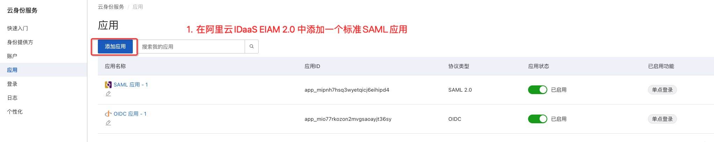
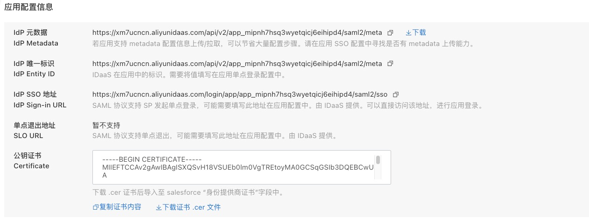
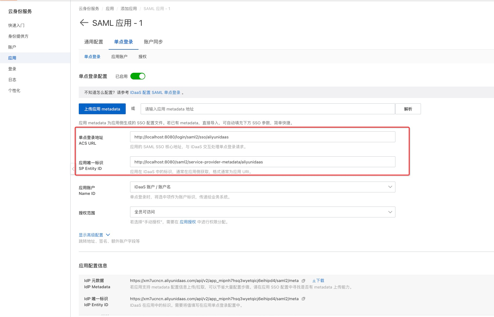
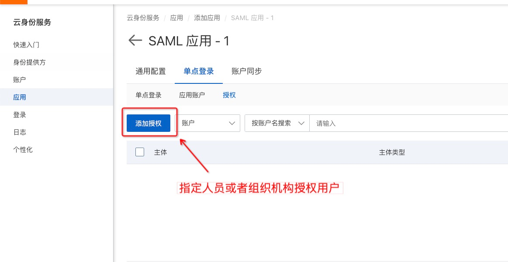
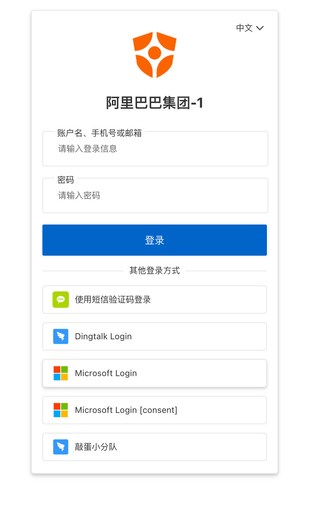
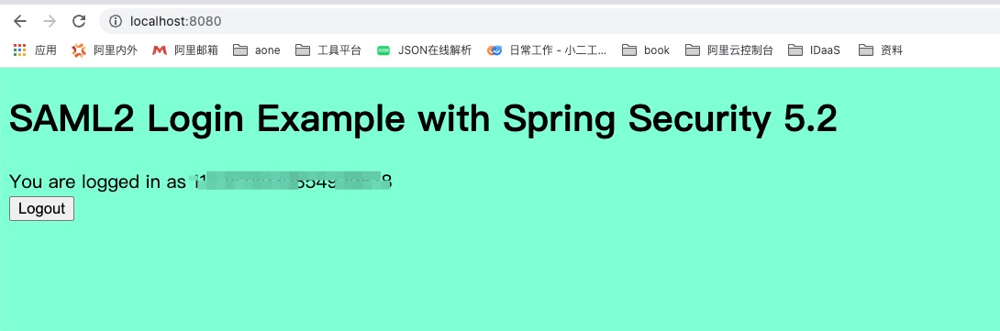

# 快速开始

## 第一步：注册应用



## 第二步：修改配置

修改`application.yml`文件中的 idp 配置

```yaml
spring:
    security:
        saml2:
            relyingparty:
                registration:
                    aliyunidaas:  # samlexample 即为 {registrationId} 可为任意字符串
                        signing:
                            credentials:
                                  certificate-location: "classpath:credentials/public.cer"  # 即公钥目录地址
                        identityprovider:
                            entity-id: #idaas中拿到的 IdP 唯一标识- IdP Entity ID
                            singlesignon:
                                sign-request: false 
                                url:  #idaas 中拿到的 IdP SSO 地址
                            metadata-uri:  #idaas中拿到的 IdP 元数据
```

同时把在 idaas 注册应用时拿到的公钥`public.cer`文件复制到 credentials 目录下。具体信息展示如下图所示



## 第三步：在 idaas 中添加 sp 配置信息

- 本地启动项目
- 访问`http://localhost:8080/saml2/service-provider-metadata/aliyunidaas`
- 上传拿到的`saml-aliyunidaas-metadata.xml` 文件，或者也可手动输入，如下图所示



## 第四步：在IDaaS授权指定用户（可选）



- 如图所示，在应用中为某一用户授权
- 访问 `http://localhost:8080` 
- 此时会跳转到登录认证页面



- 登录认证成功后会跳转回 `http://localhost:8080` 


# 详细实现

## 在 idaas 注册应用

同快速开始

## SP 实现

### 依赖项

- 使用 SpringBoot 版本为 2.4.1，其余依赖都使用 spring-boot-dependencies 中的默认版本号

- Saml 依赖

  ```xml
  <dependency>
      <groupId>org.springframework.security</groupId>
      <artifactId>spring-security-saml2-service-provider</artifactId>
  </dependency>
  ```

- security 相关依赖

  ```xml
  <dependency>
      <groupId>org.springframework.security</groupId>
      <artifactId>spring-security-config</artifactId>
  </dependency>
  ```
- web 相关

  ```xml
  <dependency>
      <groupId>org.springframework.boot</groupId>
      <artifactId>spring-boot-starter-web</artifactId>
  </dependency>
  ```

- 日志相关，切换 logback 为 log4j2

  ```xml
  <dependency>
      <groupId>org.springframework.boot</groupId>
      <artifactId>spring-boot-starter</artifactId>
      <exclusions>
          <exclusion>
              <groupId>org.springframework.boot</groupId>
              <artifactId>spring-boot-starter-logging</artifactId>
          </exclusion>
      </exclusions>
  </dependency>
  <dependency>
      <groupId>org.springframework.boot</groupId>
      <artifactId>spring-boot-starter-log4j2</artifactId>
  </dependency>
  ```

### SAML2 配置

- 创建 SecurityConfig 类
  - 定义受 saml 保护的路径
  - 启用**sp 元数据提供端点**，通过 URL 提供元数据 xml 文件

```java
@Configuration
public class SecurityConfig extends WebSecurityConfigurerAdapter {

    @Autowired
    RelyingPartyRegistrationRepository relyingPartyRegistrationRepository;

    @Override
    protected void configure(HttpSecurity http) throws Exception {
      
        Converter<HttpServletRequest, RelyingPartyRegistration> relyingPartyRegistrationResolver =
                new DefaultRelyingPartyRegistrationResolver(this.relyingPartyRegistrationRepository);
				// 启用 sp 元数据提供端点
        Saml2MetadataFilter filter = new Saml2MetadataFilter(relyingPartyRegistrationResolver, new OpenSamlMetadataResolver());

        // 定义受 saml 保护的路径
        http.saml2Login(Customizer.withDefaults())
            .addFilterBefore(filter, Saml2WebSsoAuthenticationFilter.class)
            .antMatcher("/**")
            .authorizeRequests()
            .antMatchers("/**").authenticated();
    }
}
```

### 创建index页面

在 resources 目录下创建 templates 目录，并创建一个 index.html 页面，用以后续的访问。

```xml
<!doctype html>
<html xmlns="http://www.w3.org/1999/xhtml" xmlns:th="https://www.thymeleaf.org" xmlns:sec="https://www.thymeleaf.org/thymeleaf-extras-springsecurity5">
<head>
    <title>Spring Security SAML2</title>
</head>
<body style="background-color: aquamarine;">
<h1>SAML2 Login Example with Spring Security 5.2</h1>
<div>You are logged in as <span sec:authentication="name"></span></div>
<div>
    <form th:action="@{/logout}" method="post">
        <input type="submit" value="Logout" />
    </form>
</div>
</body>
</html>
```

### 定义受保护 API

```java
@Controller
public class AppController {

    // 将跳转至刚刚创建的 index.html 页面
    @GetMapping("/")
    public String index() {
        return "index";
    }

  	//如不使用模版引擎则可以访问该端点
    @GetMapping("/sensitive_resource")
    public String getSensitiveResource() {
        return "success";
    }
}
```

### 添加验签公钥

在 resources 目录下创建 credentials 目录。

将在 idaas 注册应用时拿到的公钥`public.cer`文件复制到 credentials 目录下。

### 配置 IdP 信息

- 在 `application.yml`中添加 IdP 配置信息，包括如下内容

```yaml
spring:
  security:
    saml2:
      relyingparty:
        registration:
          aliyunidaas: # samlexample 即为 {registrationId} 可为任意字符串
            signing:
              credentials:
                certificate-location: "classpath:credentials/public.cer"  # 即公钥目录地址
            identityprovider:
              entity-id:  #idaas中拿到的 IdP Entity ID
              singlesignon:
                sign-request: false
                url:  #idaas 中拿到的 IdP SSO 地址
              metadata-uri:  #idaas中拿到的 IdP Metadata
```

### 获取 SP 的配置信息

- sp 需要向 idaas 提供 ACS 地址和 entityID，生成规则如下
  - ACS 地址：`{baseUrl}/login/saml2/sso/{registrationId}` 
  - entityID：`{baseUrl}/saml2/service-provider-metadata/{registrationId}` 
  - 元数据端点 URL ：同 entityID

```yaml
server:
    servlet:
        context-path: /  # 此处为{baseUrl}
```
也可以自定义ACS地址
```yaml
spring:
  security:
    saml2:
      relyingparty:
        registration:
          aliyunidaas: # samlexample 即为 {registrationId} 可为任意字符串
            acs:
              location: "{baseUrl}/login/saml2/sso/{registrationId}" 
```

## 在 idaas 中添加 sp 配置

- 添加 sp 配置的方式
  - 上传从元数据端点 URL 下载到的 xml文件。
  - 输入元数据端点 URL ，idaas 会自动解析，前提是可以访问到该地址。
  - 手动输入，如下图所示。


## 访问

同快速开始
